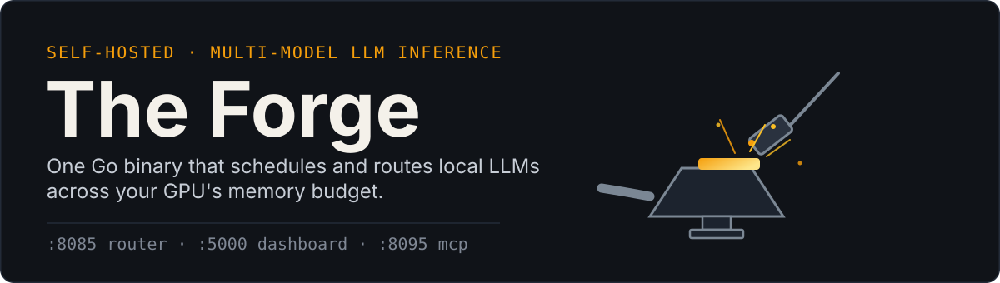
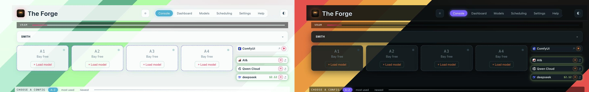
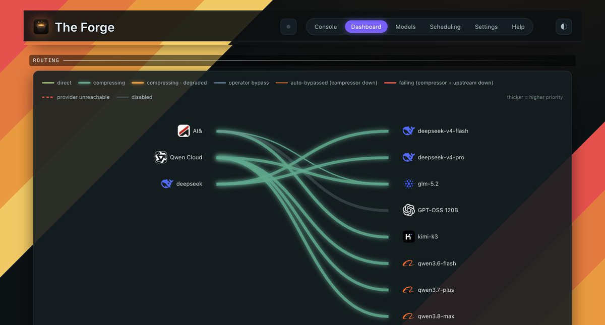
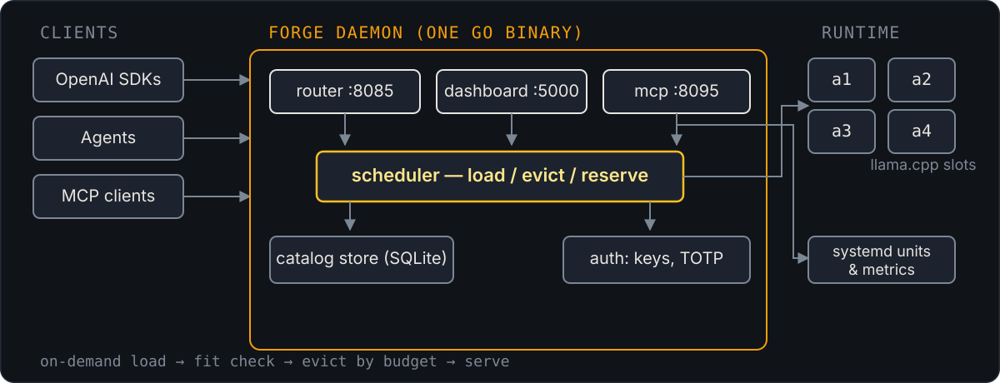
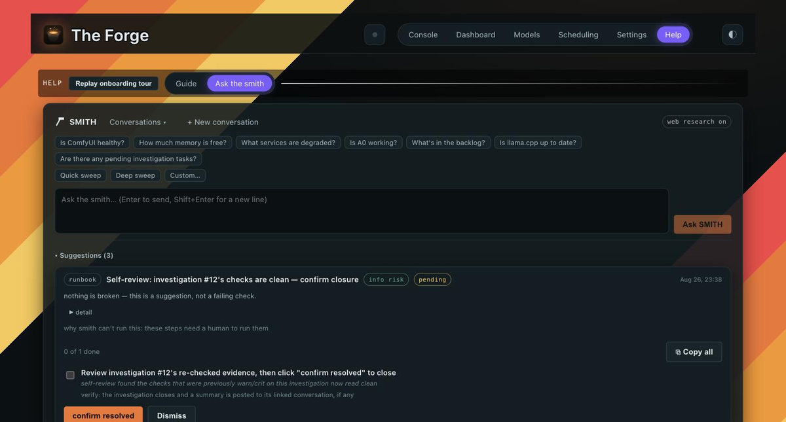

<div align="center">



[](LICENSE)


[](https://buymeacoffee.com/jsaigou)

</div>

The Forge is a single Go binary for running several local LLMs on one machine: a scheduler that
loads models on demand and evicts by memory budget, a router with cloud failover, a live model
catalog, and an in-process agent (Smith) that watches the host and can act on what it finds.
Built for AMD's unified-memory APUs (Ryzen AI Max+ 395 / "Strix Halo"), where GPU and CPU share
one pool of RAM.

<p align="center">
  
</p>

---

## Why unified memory changes things

On Strix Halo-class hardware there's no discrete VRAM — the GPU draws from the same pool as the
OS, through GTT allocation most llama.cpp tooling isn't tuned for.

- **ROCm vs. Vulkan is a per-model decision.** Vulkan tops out around 63 GB; ROCm with
  `GGML_CUDA_ENABLE_UNIFIED_MEMORY=ON` reaches the full ~120 GB GTT pool, at a higher launch
  cost and its own memory accounting.
- **The kernel can silently reduce your context window** if it can't find a contiguous GTT
  block, with nothing in a stock llama-server deployment reporting it.
- **Running several models at once** — a coding model, a small router brain, an image
  pipeline — needs real memory budgeting and eviction, not a restart to switch models.

## What it does

| | |
|---|---|
| Scheduler | Four inference slots share the memory pool. Models load on first request and evict on idle, against a byte-level budget rather than a fixed model-per-process assignment. |
| `a0` router | One OpenAI-compatible endpoint in front of local slots and remote providers, with per-provider failover, usage tracking, and cost accounting. |
| Smith | An in-process agent running deterministic health checks (GPU hangs, silent context reduction, drifted builds, orphaned services). It can propose a fix, walk you through a runbook, or run the safe ones itself under an explicit autonomy policy. |
| `forge-compress` | A native Go/ONNX context-compression proxy for local and cloud-routed traffic. |
| Catalog | Models, quantizations, pricing, and benchmarks live in SQLite, editable through the UI or a CRUD API. |
| One binary | Dashboard, router, MCP server, and scheduler run as one Go process — no separate services to keep in sync. |

<p align="center">
  
</p>

## How it works



Reference hardware: an AMD Ryzen AI Max+ 395-class APU (gfx1151), 128 GB unified RAM, ~120 GB
addressable GTT, Linux with SELinux enforcing. Other Strix Halo-class unified-memory APUs should
work the same way.

### Smith

<p align="center">
  
</p>

Smith answers from the same deterministic checks, scheduler state, and system journals an
operator would otherwise read by hand.

## Repository layout

```
go/
  cmd/forge/           — the `forge` binary: daemon (dashboard :5000, a0 :8085, MCP :8095)
                         + client CLI/TUI (status/models/load/unload/tui)
  cmd/forge-compress/  — context-compression proxy
  cmd/forge-tts/       — TTS launcher
  internal/engine/     — llama-server slot lifecycle (systemd + dbus)
  internal/sched/      — scheduler: placement, eviction, reservations
  internal/router/     — a0: routing, provider failover, streaming proxy
  internal/httpapi/    — dashboard REST API + SSE bus
  internal/smith/      — the ops agent: deterministic checks + LLM reasoning + procedures
  internal/store/      — SQLite catalog/settings/auth store + migrations
  internal/compress/   — context-compression engine (ONNX scorer)
web/                   — React PWA dashboard (Vite; built into the Go binary)
systemd/               — forge-daemon, forge-a1..a4 slots, always-on service units
polkit/                — passwordless unit-management grants
scripts/               — deploy tooling, install/upgrade script
docs/                  — architecture, runbooks, ADRs
```

## Configuration

Everything is store-backed — no TOML/YAML files to hand-edit and redeploy.

- **Model catalog** (models, variants, configs, offerings, benchmarks): SQLite, edited live via
  Settings → Catalog or `POST/PUT /api/v1/catalog/*`.
- **Infra config** (ports, slots, scheduler, cost, router timeouts): a settings KV, edited via
  `forge config get/set` or the Settings API.
- **Auth** (users, API keys, WebAuthn, recovery codes): the auth store (Settings → Security).

### Adding a model

Models → **Add Model** searches Hugging Face, ranks a repo's GGUF files against the current
memory budget, and runs pre-flight checks (disk headroom, required backend, file conflicts)
before you commit. Downloads are resumable and a sharded repo downloads as one job. Once
verified, the model registers itself into the catalog (Model, Variant, Artifact, Config); the
new Config lands `unverified`/`hidden` until you promote it. Gated repos need a token first
(Settings → Security → Hugging Face access token).

The same flow is exposed as smith tools (`hf_search`, `hf_preflight`, `download_status`, and a
`download_start` that only proposes a job — nothing downloads until you approve it). See
[docs/adding-a-model.md](docs/adding-a-model.md).

## Installation

> Targets Linux + AMD ROCm (tested on Strix Halo-class APUs with unified memory). Builds are
> plain Go; other GPUs work wherever llama.cpp does.

```bash
git clone https://github.com/jsaigou/the-forge.git && cd the-forge
go build ./go/cmd/forge        # build the daemon
cd web && npm ci && npm run build && cd ..   # build the dashboard assets

sudo ./install.sh              # fresh install, dependency checks on
sudo ./install.sh --upgrade    # in-place upgrade
sudo ./install.sh --dry-run    # show every check, make no changes
```

`install.sh` checks the platform (kernel, GPU, ROCm, Vulkan) and installs units and application
files — there's no config file to write. See [docs/deployment.md](docs/deployment.md) for the
full step list.

## Usage

```bash
forge status                     # slots, memory budget, GTT
forge models                     # list loadable catalog configs
forge load <config-name> [slot]  # default slot if omitted
forge unload a3
forge tui                        # full-screen console: Overview/Slots/Services/Compressor/Keys/Smith
```

The router loads whatever's requested on first use and evicts idle slots when memory is needed.
Point any OpenAI-compatible client at `http://localhost:8085/v1`.

Verify a config loaded at its intended context:

```bash
curl -sf http://localhost:8080/props | jq .default_generation_settings.n_ctx
```

See [docs/pitfalls.md](docs/pitfalls.md) for why this is worth checking after every switch.

## Notable behavior

- `GGML_CUDA_ENABLE_UNIFIED_MEMORY=ON` is required for models above ~63 GB on the ROCm backend.
- `--parallel` should always be set explicitly — above 1, it *splits* configured context across
  workers rather than adding capacity.
- `TimeoutStopSec` should be ≥ 300; large models can take minutes to unload.
- `n_ctx` can silently drop below what's configured; check it after every switch.

Full list in [docs/pitfalls.md](docs/pitfalls.md).

## Features

- OpenAI-compatible `/v1` chat/completions routing across up to four slots
- On-demand loading with blocking hold (~150 s) instead of hard failures
- Fit checks and read-only capacity planning (`can_fit`)
- Time-boxed reservations with per-agent attribution
- Store-backed model catalog with live CRUD APIs
- Tailscale-aware auth (conditional bypass, per-policy), API keys, TOTP/passkeys
- Always-on sidecars: embeddings, speech-to-text, text-to-speech

## Documentation

| Doc | Contents |
|---|---|
| [docs/scheduler.md](docs/scheduler.md) | slot scheduling, reservations, MCP role |
| [docs/llm-router.md](docs/llm-router.md) | router design and failover |
| [docs/deployment.md](docs/deployment.md) | install, units, operations |
| [docs/modes.md](docs/modes.md) | model configuration concepts |
| [docs/adding-a-model.md](docs/adding-a-model.md) | cataloging a new model |
| [docs/pitfalls.md](docs/pitfalls.md) | operational sharp edges |
| [docs/adr/](docs/adr/) | architecture decision records |

## Status

Early public release: source and installer are published for review. Binaries and model weights
aren't distributed — build from source against your own llama.cpp. Expect churn in the scheduler
and auth surfaces while the v0.5 line stabilizes.

## Support

If this saved you some GPU-memory headaches, [buymeacoffee.com/jsaigou](https://buymeacoffee.com/jsaigou).

## License

Apache-2.0 — see [LICENSE](LICENSE).
